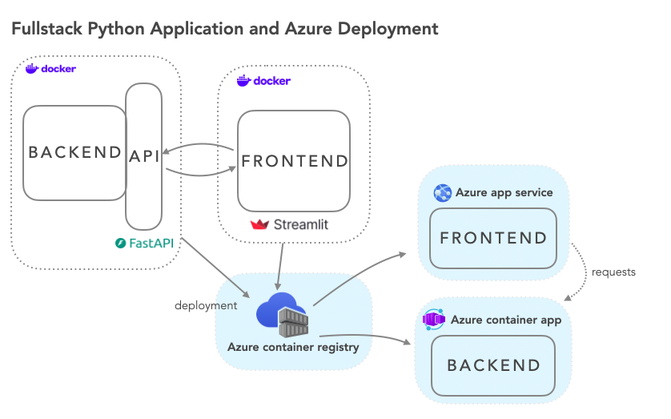

# FastAPI + Streamlit → Docker → Azure

Backend (FastAPI) och frontend (Streamlit) som separata, frikopplade delar. De pratar med varandra via HTTP-requests, körs i varsin Docker-container, och deployas till Azure.

```
Backend (FastAPI, Docker) <--requests--> Frontend (Streamlit, Docker) --> Deploy till Azure
```

## 1. Skapa projektstruktur (lokalt, VS Code)

```bash
uv init --no-package --python 3.13
uv init --package backend
uv init --package frontend
```

- Lägg till dependencies i respektive `pyproject.toml` (backend/frontend var för sig)
- Installera allt:
```bash
uv sync --all-packages
```

## 2. Kör lokalt (utan Docker) – för att testa innan containerisering

**Backend:**
```bash
uv run uvicorn api:app --reload
```
Startar FastAPI-servern på `http://127.0.0.1:8000`. Testa t.ex. `http://127.0.0.1:8000/pokemon/stats`.

**Frontend:**
```bash
uv run streamlit run dashboard.py
```

## 3. Dockerize

Öppna Docker Desktop (måste vara igång).

**`backend.dockerfile`:**
```dockerfile
FROM python:3.13-slim

COPY backend/ /app/

RUN pip install --no-cache-dir uv

WORKDIR /app
RUN uv sync --no-dev

WORKDIR /app/src/backend
CMD ["uv", "run", "uvicorn", "api:app", "--host", "0.0.0.0"]
```

**`frontend.dockerfile`:**
```dockerfile
FROM python:3.13-slim

COPY frontend/ /app/

RUN pip install --no-cache-dir uv

WORKDIR /app
RUN uv sync --no-dev

WORKDIR /app/src/frontend
CMD ["uv", "run", "streamlit", "run", "dashboard.py", "--server.address", "0.0.0.0"]
```

`--host 0.0.0.0` / `--server.address 0.0.0.0` gör att servern accepterar anrop både lokalt och utifrån containern.

**`docker-compose.yaml`:**
```yaml
services:
  backend:
    container_name: backend
    build:
      context: .
      dockerfile: dockerfiles/backend.dockerfile
    ports:
      - "8000:8000"

  frontend:
    container_name: frontend
    build:
      context: .
      dockerfile: dockerfiles/frontend.dockerfile
    ports:
      - "8501:8501"
    environment:
      BACKEND_URL: http://backend:8000
```

`context: .` innebär att build-processen ser hela rotmappen (där `docker-compose.yaml` ligger).

**Bygg och starta:**
```bash
docker compose up -d
```

## 4. Koppla frontend mot backend

I `dashboard.py`:
```python
import os

# Läser miljövariabeln BACKEND_URL, annars fallback till localhost
BASE_URL = os.getenv("BACKEND_URL", "http://127.0.0.1:8000")
```

Detta gör att samma kod funkar både lokalt (fallback) och i Docker (miljövariabeln sätts i `docker-compose.yaml`).

## 5. Användbara Docker-kommandon

```bash
docker ps                          # lista körande containers
docker exec -it <container_id> bash   # hoppa in i en körande container
docker run -it <image_name> bash      # starta en ny container interaktivt (om ingen redan kör)
```

Inne i en container, t.ex.:
```bash
cat api.py        # visa filinnehåll
uv pip freeze      # lista installerade paket
exit               # (Ctrl+D) lämna containern
```

## 6. Azure Container Registry (ACR)

**I Azure Portal:**
1. Skapa en resource group
2. Skapa ett Container Registry
3. Under **"Access keys"** → aktivera **Admin user**, kopiera **Login server**

**I `docker-compose.yaml`**, lägg till image-namn (byggs mot ditt registry):
```yaml
services:
  backend:
    image: <login-server>/backend:v1
  frontend:
    image: <login-server>/frontend:v1
```

**I terminalen:**
```bash
az acr login --name <login_server>   # logga in mot registry (kräver az login sedan innan)

docker compose build     # bygg images lokalt
docker images             # bekräfta att de nya images finns
docker compose push       # pusha upp till Azure Container Registry
```

## 7. Azure Container App – backend

I Azure Portal:
1. Skapa en Container App i rätt resource group
2. Peka på imagen i ditt Container Registry
3. Aktivera **Ingress** (tillåter in/utgående trafik/requests)
4. Testa via **Application URL** (lägg ev. till `/docs` för FastAPI:s auto-genererade dokumentation)

## 8. Azure App Service – frontend

I Azure Portal:
1. Skapa en **Web App** (välj **Container**, inte databas)
2. Under **Environment variables**, lägg till:
   - `WEBSITES_PORT` = `8501` (porten Streamlit körs på)
   - `BACKEND_URL` = `<Application URL från backend Container App>`
3. Starta om appen (refresh)
4. Öppna **Default domain** → ska visa Streamlit-dashboarden


# Terraform deploy container


